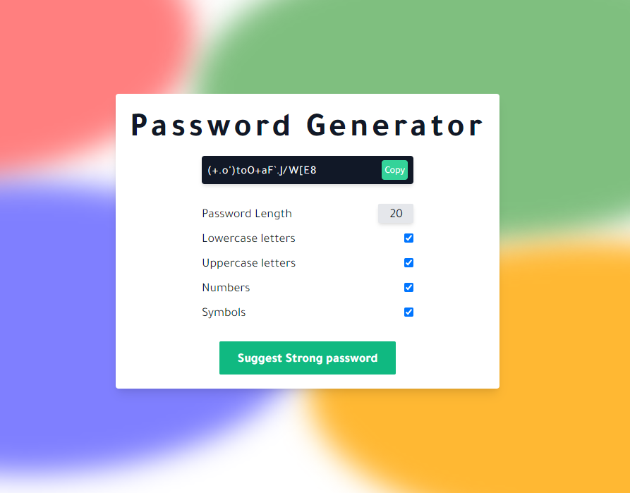

# ReactJs Password Generator

Check out the demo here: https://tsbdesigns-password-generator.netlify.app

This is a simple Password Generator built in ReactJs with functionalities such as:

1. Generate random password (obviously)
2. Generate passwords depending on what the user selects in the checkboxes.
3. Copy to clipboard functionality using the Clipboard API (Sounds complicated - it's not)
4. A (not really) cool looking background with centered box. (Cue "amazed" sounds)
